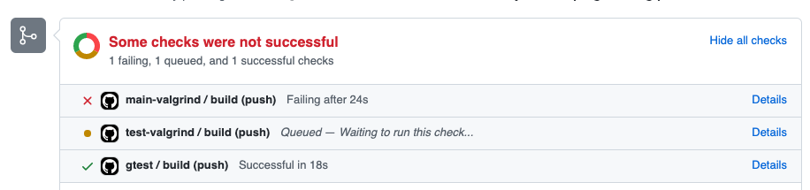

# C-programming-pre-lab <!-- omit in toc -->

[](../../actions?query=workflow%3A"gtest")
[](../../actions?query=workflow%3A"main-valgrind")
[](../../actions?query=workflow%3A"test-valgrind")


This is a pre-lab to get you started started on compiling and running C programs
and using `valgrind` to identify memory leaks.  The tools have been installed on the lab computers.  
Be aware that if you want to use your own machine you will have to go through quite a few extra steps to
install the `gtest` test suite and the `valgrind` memory leak detection program (both described below)

- [Background](#background)
  - [Compiling and running a C program](#compiling-and-running-a-c-program)
  - [Compiling and running the tests](#compiling-and-running-the-tests)
  - [Using valgrind to find memory leaks](#using-valgrind-to-find-memory-leaks)
- [GitHub Actions and badges](#github-actions-and-badges)
- [What to do](#what-to-do)

## Background

This pre-lab helps prepare us for the next several labs.
These are a number of
C programming exercises with an emphasis on arrays, pointers,
memory management, and system calls.

There is a truly vast amount of information on C out there on the
Internet; Wikipedia alone has a remarkable amount of info on C. There's
no way we could have gone through it all or know the "best"
resources. Here we've shared things we found helpful at some
point, but
there are no doubt zillions of good
resources out there we've never heard of so feel free to share
things you find helpful.

[CProgramming.com has a decent
on-line C tutorial](<http://www.cprogramming.com/tutorial.html#ctutorial>), complete with little self-tests along the way. _I would **strongly**
recommend trying out the self-tests as a basic way of checking your
understanding._ Some
particularly useful lessons in this context would be:

- [Overview of pointers in C](http://www.cprogramming.com/tutorial/c/lesson6.html)
- [Overview of structs in C](https://www.cprogramming.com/tutorial/c/lesson7.html)
- [Overview of arrays in C](http://www.cprogramming.com/tutorial/c/lesson8.html)
- [Overview of strings in C](http://www.cprogramming.com/tutorial/c/lesson9.html)
- [Overview of command line arguments in C](http://www.cprogramming.com/tutorial/c/lesson14.html)

Some other potentially useful bits of information from Wikipedia:

- [A nice review of why C has header files, and how they're typically used.](http://en.wikipedia.org/wiki/Header_file)
- [On the craziness that is booleans (or the lack thereof) in C.](https://en.wikipedia.org/wiki/Boolean_data_type#C,_C++,_Objective-C,_AWK)
- [A nice overview of C structs](http://en.wikipedia.org/wiki/Struct_(C_programming_language))

### Compiling and running a C program

In the exercise below you'll need to edit, (re)compile, and run the C
program `check_whitespace.c` that is provided in this repository.
Assuming you're in the project directory, you can compile
this using the command

```bash
gcc -g -Wall -o check_whitespace main.c check_whitespace.c
```

`gcc` is the GNU C Compiler, which, along with Clang/LLVM, dominates the
C/C++ compiler space on Linux boxes these days. The meaning of the flags:

- `-g` tells `gcc` to include debugging information in the generated
  executable. This is allows, for example, programs like `valgrind`
  (described below) to list line numbers where it thinks there are
  problems. Without `-g` Valgrind (and other debugging tools) will
  be able to specify the name of functions where there are problems,
  but not give you line numbers.
- `-Wall` (it's a capital 'W') is short for "Warnings all" and turns
  on *all* the warnings that `gcc` supports. This is a Very Good Idea
  because there are a ton of crazy things that C will try to
  "understand" for you, and `-Wall` tells the compiler to warn you
  about those things instead of just quietly (mis)interpreting them.
  You should typically use `-Wall` and make sure to figure out and
  clean up any warnings you do get.
- `-o <name>` tells `gcc` to put the resulting executable in a file
  with the given name. If you don't provide the `-o` flag then `gcc`
  will write the executable to a file called `a.out` for strange
  historical reasons.

After the flags, we provide a list of all the `.c` files that need to be
compiled and [linked together](https://en.wikipedia.org/wiki/Linker_(computing))
to form a working executable.

Assuming your program compiled correctly (**check the output!**) then you
should be able to run the program like any other executable:

```{bash}
./check_whitespace
```

### Compiling and running the tests

This includes an example of using
[the GoogleTest library](https://google.github.io/googletest/)
for writing unit tests for C and C++ programs. The tests are in
`check_whitespace_test.cpp`, which has a `.cpp` extension because
tests in GoogleTest are actually C++ (`.cpp`) instead of just C.

If you are using lab machines the `gtest` libraries have already been installed, 
but if you want to run the tests on your local machine, then you'll need to install them.

Curtis Larson of Utah Tech has provided [good instructions](https://cit.dixie.edu/faculty/larsen/google-test-installation.php)
on installing the `gtest` suite on various OS's.

Below are examples of a few tests in GoogleTests:

```c++
TEST(Strip, WhitespaceOnBothEnds) {
    ASSERT_STREQ("frog", strip("  frog     "));
}

TEST(IsClean, NoWhitespace) {
    ASSERT_TRUE(is_clean("University of Minnesota Morris"));
}
```

The two arguments to `TEST` are arbitrary names. The first is the name of
the _suite_ this test is part of; we just used the name of the function
being tested by this test (`Strip` or `IsClean`). The second is the name
of this particular test, and should hopefully provide some useful information
on what's being tested here.

GoogleTest has quite a few assertions. Here we're using `ASSERT_STREQ`, which
asserts that two strings (`STR`) are equal (`EQ`), and `ASSERT_TRUE`.

To compile this is considerably more complicated because we have to use C++
and we need to include the GoogleTest library:

```text
g++ -Wall -g -o check_whitespace_test check_whitespace.c check_whitespace_test.cpp -lgtest
```

Here we're using `g++` instead of `gcc` to indicate that we want the C++ compiler.
We've also added the `-lgtest` at the end, telling the compiler to include the
`gtest` _library_ (hence the `-l`) when constructing the final executable. Also
note that we're _not_ including `main.c` when we compile the test code;
`check_whitespace_test.cpp` contains a `main()` function so we _can't_ include
`main.c` (which provides a `main()` function), or the system won't know which
one to call.

Assuming your program compiled correctly (again, **check the output!**) then you
should be able to run the test code:

```{bash}
./check_whitespace_test
```

If all the tests pass (and they should initially) you should get something like:

```text
$ ./check_whitespace_test 
[==========] Running 10 tests from 2 test cases.
[----------] Global test environment set-up.
[----------] 5 tests from strip
[ RUN      ] strip.EmptyString
[       OK ] strip.EmptyString (0 ms)
[ RUN      ] strip.NoWhitespace
[       OK ] strip.NoWhitespace (0 ms)
[ RUN      ] strip.WhitespaceOnFront
[       OK ] strip.WhitespaceOnFront (0 ms)
[ RUN      ] strip.WhitespaceOnBack
[       OK ] strip.WhitespaceOnBack (0 ms)
[ RUN      ] strip.WhitespaceOnBothEnds
[       OK ] strip.WhitespaceOnBothEnds (0 ms)
[----------] 5 tests from strip (0 ms total)

[----------] 5 tests from is_clean
[ RUN      ] is_clean.EmptyString
[       OK ] is_clean.EmptyString (0 ms)
[ RUN      ] is_clean.NoWhitespace
[       OK ] is_clean.NoWhitespace (0 ms)
[ RUN      ] is_clean.WhitespaceOnFront
[       OK ] is_clean.WhitespaceOnFront (0 ms)
[ RUN      ] is_clean.WhitespaceOnBack
[       OK ] is_clean.WhitespaceOnBack (0 ms)
[ RUN      ] is_clean.WhitespaceOnBothEnds
[       OK ] is_clean.WhitespaceOnBothEnds (0 ms)
[----------] 5 tests from is_clean (0 ms total)

[----------] Global test environment tear-down
[==========] 10 tests from 2 test cases ran. (0 ms total)
[  PASSED  ] 10 tests.
```

You should make sure you recompile and rerun the tests after you
make changes while fixing the memory leak problems down below. It's
not enough to just fix the memory leaks if you also break the code in
the process, and the tests should help ensure that you're good there.

### Using valgrind to find memory leaks

One of the more subtle problems with explicit memory management is that
you can allocate memory that you never free up again when you're done
with it. This will typically never lead to an error, but can cause a
long-running process to consume more and more memory over time until its
performance begins to degrade or it ultimately crashes the system. Since
system processes (e.g. file servers, authentication servers, and web servers)
often run for days, weeks, or months
between restarts, a memory leak in such a program can be quite serious.
As a simple example, consider the (silly) function:

```C
void f(char *str) {
    char *c = calloc(100, sizeof(char));
    /* Do stuff with c */
    return 0;
  }
```

The problem here is the fact that `f` allocates 100 bytes (100
characters) for `c` to point, but these are never freed. This means that
every time we call `f`, 100 bytes will be allocated to this process that
we'll *never* be able to get back because we have no way of accessing
that pointer outside of `f`. To fix that problem (assuming we really
need to allocate that space) we need to free it before we return:

```C
void f(char *str) {
    char *c = calloc(100, sizeof(char));
    /* Do stuff with c */
    free(c);
    return 0;
  }
```

These sorts of memory leaks can actually be really nasty to spot, so
happily there's a nice program called `valgrind` that can help identify
them. If your executable is `my_prog`, then running

``` {bash}
valgrind ./my_prog
```

will run the program as normal, and then print out a memory usage/leak
report at the end. If your system doesn't have `valgrind` you can install it (on Linux or Windows WSL)
using `sudo apt-get install valgrind`.  On Mac follow [these directions](https://macappstore.org/valgrind/).

When using `valgrind`, to get more detailed information, including what
lines generate a leak,

- Make sure to compile your program with the `-g` flag, and
- Add the `--leak-check=full` flag when running `valgrind`:

```bash
      valgrind --leak-check=full ./my_prog
```

If there are memory issues, this generates lots of output of the form:

```english
    ==28587== 18 bytes in 1 blocks are definitely lost in loss record 50 of 50
    ==28587==    at 0x400522F: calloc (vg_replace_malloc.c:418)
    ==28587==    by 0x80486AE: str_reverse (palindrome.c:12)
    ==28587==    by 0x804870A: palindrome (palindrome.c:27)
    ==28587==    by 0x80487FF: not_palindrome (palindrome_test.c:13)
    ==28587==    by 0x8048963: test_long_strings (palindrome_test.c:54)
    ==28587==    by 0x804A1B8: _run_test (cmockery.c:1519)
    ==28587==    by 0x804A5A7: _run_tests (cmockery.c:1624)
    ==28587==    by 0x80489B3: main (palindrome_test.c:68)
```

This tells you that:

- 18 bytes were lost, and that
- they were allocated by `calloc` (the top line of the trace),
- which was called on line 12 of
`palindrome.c` in the function `str_reverse` (next to top line of the
trace), etc.

Note that this tells you where the lost bytes were
*allocated*, which doesn't always tell you much about where they should
be *freed*, as that's going to depend on how they're used after they're
allocated.

:warning: not all of these output blocks will be useful. Look for ones that
refer to some of _your_ code somewhere, like `strip` or `is_clean`.

There are two common types of memory leaks, one of which is frankly easier to
sort out than the other.

The easy ones are where function `f()` allocates _local_ memory (memory
no one but `f()` uses) and doesn't free it up before it exits. The
solution to this is typically just to free up the memory before `f()`
exits.

The trickier ones are where `f()` allocates memory that it _returns_
to whoever called it, say a function `g()`. `f()` _can't_ free that
memory before it exits, because that would invalidate the memory
being returned to `g()`. This makes it _`g()`'s_ responsibility to
free up the memory in question after _it's_ done with it. If `g()`
returns that memory back up to whoever called `g()` (say `h()`),
then `g()` also can't free it and it becomes `h()`'s responsibility.
This can push the responsibility all the way to "top level" code like
the `main()` method or even testing code. So carefully trace the uses
until you get to someplace where you know the memory will never be
used again, and that's where you'd insert the necessary `free()` call.

:bangbang: One non-obvious, but important, place to look for memory leaks is
in the test code. If the test code calls some function `f()` that returns an
array or string that is allocated somewhere in `f` (or a function `f` calls),
then that memory is lost if the test code doesn't free up that returned array.
So if `valgrind` says there's a leak where some memory is allocated in a
function and then returned to the test code, then the fix is
_in the test code_. In general we don't encourage you to fiddle with the
test code (you could always just change the test code to say everything
passes!), but if the memory leaks to the test code, then that's where the
fix has to be made.

:raising_hand: **Tip:** If you need to free a value and you don't have a
name for it, _give it one_. E.g., add an assignment statement like
`s = value_to_free()` that gives that value (`value_to_free()`) a name
(`s`) so you can free it with something like `free(s)`. Also, don't forget
how to write clean code just because you're using C. If you find yourself
with multiple functions with the same structure, is there a way you can
write a helper function that captures that structure so you don't have to
repeat it over and over?

Once you have everything happy, you will hopefully get a line like:

```text
==357046== ERROR SUMMARY: 0 errors from 0 contexts (suppressed: 0 from 0)

```

at the end indicating that you now have 0 errors and all is well.

## GitHub Actions and badges

We've set up GitHub Actions to automatically run three checks on your
code every time you push changes to GitHub:

- The code compiles and the tests pass.
- Valgrind returns no errors when running the `main` function.
- Valgrind returns no errors when running the test code.

You should be able to see the status of these in a commit or pull request
in GitHub. Here, for example, is a status from a pull request:



We have all three possible status indicators here:

- The red x indicates a failing check
- The orange dot indicates a check that's still in progress
- The green checkmark indicates a check that passed

When you initially check out the code for the pre-lab, the `gtest`
check should pass (the tests pass), but the other two should fail
because there are memory issues with both the `check_whitespace`
`main()` and the tests.

We have also added three badges to the top of this README that indicate
the status of each of these three status checks. The tests badge should
be green from the beginning (and stay green throughout the process).
The two `valgrind` badges will both start off red (because the `valgrind`
checks fail initially) but turn green after you've fixed the memory
management issue.

> :warning: The badges won't update instantly, so don't fret if
> your status checks are green but the badge is still red. That
> should update in a few minutes.

## What to do

- [ ] Compile the program `check_whitespace`
    and run `valgrind` on it to find any leaks it may have (hint: it has at
    least one).
- [ ] Also compile `check_whitespace_test` and run `valgrind` on the test code, to
      find any leaks there (there are several).
- [ ] In `leak_report.md` describe why the memory errors happen, and how to fix them.
- [ ] Actually fix the code.
- [ ] Commit, push, etc.
- [ ] Submit the URL for your repository as instructed elsewhere
